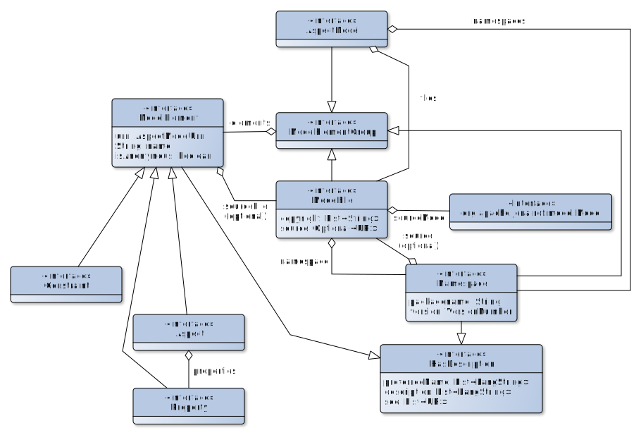

# Model Resolution

## Context and Problem Statement

As described in [ADR-0004](0004-urn-as-identifiers.md), URNs are used to identify model elements and
allow decoupling identification of model elements from resolving them. In contrast to using URLs as
both identifiers and locators, this allows resolving model elements from different kinds of sources
in different contexts. To enable interoperable tooling and ensure consistent workflows for users, a
certain set of guidelines are required. This decision record outlines common concepts about how
model elements are organized in files and other structures and how model elements should be
resolved.

## Decision Drivers

* Certain assumptions and workflows specific to tools and projects were established, not all of
  which are completely consistent with each other. This includes, but is not limited to:
  * The model resolution Java API (AspectModelResolver, ResolutionStrategy) in the
    [esmf-sdk](https://github.com/eclipse-esmf/esmf-sdk).
  * The [models directory
    structure](https://eclipse-esmf.github.io/esmf-developer-guide/tooling-guide/samm-cli.html#models-directory-structure)
    as used in samm-cli.
  * The [workspace structure](https://eclipse-esmf.github.io/ame-guide/namespace/workspace.html) as
    used in the Aspect Model Editor.
  * The organization of Aspect Models and namespaces in the CatenaX/[TractusX Semantic
    Models](https://github.com/eclipse-tractusx/sldt-semantic-models/).

## Common Rules and Concepts

### Definitions

* Definition 1: An instance of a SAMM meta model concept or of a _samm:Entity_ is called a _model
  element_.
* Definition 2: A model element that is identified by a URN is called a _named model element_.
* Definition 3: A model element that is represented by an anonymous node in an RDF document is
  called an _anonymous model element_.
* Definition 4: A _namespace identifier_ is the part of an Aspect Model Identifier before the `#`
  symbol.
* Definition 5: A _model element definition_ is the union of the following sets of RDF statements:
    * The RDF statement `?subject rdf:type ?type` with `?subject` being a valid Aspect Model Element
      Identifier and `?type` being a Meta Model Identifier or an Aspect Model Element Identifier,
      and all other RDF statements that also have the same `?subject`. The element identified by the
      URN `?subject` is a model element.
    * All RDF statements about subjects represented by anonymous RDF nodes that are transitively
      reachable by statements of either this statement set or the statement set from the previous
      bullet.

  Intuitively, the model element definition is the definition of a subject using rdf:type and all
  its attributes, including those that happen to have anonymous RDF nodes or RDF lists as values.
* Definition 6: An identifiable group of model element definitions is called an _aspect model file_.
  Note that even though in filesystem-based representations an aspect model file is an actual file,
  other representations of aspect model files are possible, for example as named graphs in an RDF
  triple store.
* Definition 7: A `namespace` is the logical grouping of named model elements that share the same
  namespace identifier.
* Definition 8: A `namespace element definition` is the pseudo-model element definition statement
  `?namespace rdf:type samm:Namespace` where `?namespace` is a namespace identifier and additional
  optional statements with the same subject and RDF properties `samm:preferredName`,
  `samm:description` and `samm:see`. The namespace element definition is contained in an aspect
  model file, but it is not logically contained in a namespace.
* Definition 9: The set of aspect model files that contain model elements that all share the same
  namespace is called the _namespace files_. I.e., all model elements from a set of namespace files
  are all defined in the same namespace.
* Definition 10: A _models root_ is an identifier for a place where aspect model files are stored.
  It could be a file system folder, a URL of a GitHub repository, a SPARQL endpoint URL or similar.
* Definition 11: A _resolution strategy_ is a function that takes a models root and an Aspect Model
  Element Identifier as input and returns the model element definition for the model element
  identified by the Aspect Model Element Identifier, including information about the aspect model
  file that contains the model element definition; or indicates a resolution failure (i.e., no model
  element definition exists in this models root). It is allowed that the resolution strategy can be
  configured with additional configuration (such as credentials), but this configuration should not
  be required to be given in each function call.
* Definition 12: An _aspect model resolver_ is a function that takes at least one models root, at
  least one resolution strategy and at least one Aspect Model Element Identifier as input and
  returns model element definitions for all transitively referenced model elements. Note that model
  elements referred to by samm:see are not considered referenced in an aspect model resolver.

### Restrictions - Rules for files, namespaces and model elements

* An aspect model file may only contain model elements of exactly one namespace.
* Model element definitions of a namespace may be spread across any number of aspect model files
  (i.e., the namespace's namespace files).
* A model element definition may only appear once per namespace and aspect model file.
* A namespace may contain any number of model elements, including `samm:Aspect`.
* An aspect model file may contain at most one model element definition for samm:Aspect.
* A namespace's set of namespace files may contain at most one namespace element definition, which must match the namespace.
* In filesystem-based model storage, aspect model files must end with ".ttl".
* In filesystem-based model storage, models should be stored in the directory structure
  _models_root_/_package_part_/_version_part_/AspectModelFile.ttl.
* In filesystem-based model storage, the namespace file containing an Aspect model element
  definition should have the same name as the Aspect's local name suffixed with ".ttl".
  
### Resolution of files

* While the aspect model resolver is responsible for resolving single model element definitions and
  therefore is considered an internal API, the public API to "load" an Aspect Model should return an
  instance of the "AspectModel" interface as shown above.
* The `AspectModel` has information about its contained namespaces, and the files it consists of
  (the `ModelFile` abstraction corresponds to the aspect model file concept described in the above
  section).

